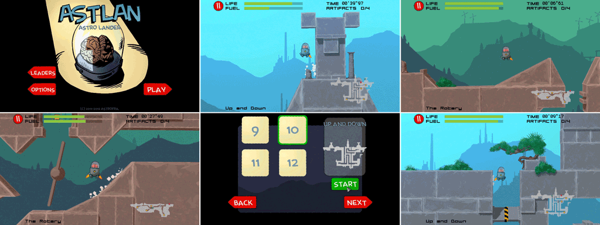

# Astrolander

> Astrolander (aka `Cosmic Lander`) is a 3D space navigation game inspired by classics such as [Lunar Lander](https://en.wikipedia.org/wiki/Lunar_Lander_(1979_video_game)), [Gravity Force](https://www.lemonamiga.com/games/details.php?id=1196), and Uchuusen by [Chris Nimmo](https://beadybox.itch.io/). Between 2011 and 2012 I crafted this game as a spare time project and documented the process extensively on the [TigSource.com](https://forums.tigsource.com/index.php?topic=20609.0) forums, a community hub for indie game developers. Additional 2D graphics by [Camille Coq](https://camillecee.weebly.com/).
>
>Astrolander is implemented in [Squirrel](https://github.com/albertodemichelis/squirrel), the 3D rendering is done on [GameStart 3D](https://www.youtube.com/@GameStart3D/videos) engine by [Emmanuel Julien](https://github.com/ejulien/). It takes advantage of the [GameStart 3D Squirrel API](https://astrofra.github.io/amiga-memories/)

### Game Overview

In Astrolander, players control a spacecraft through 25 levels of increasing difficulty, navigating obstacles and collecting items to progress. I designed the game with a simplified two-button control system to optimize the experience on tablets and smartphones, providing intuitive gameplay suitable for both casual and seasoned gamers.

### Development Highlights

- **Community Engagement:** I regularly updated and discussed the project on TigSource forums, using community feedback to refine gameplay balance and mechanics.
- **Innovative Controls:** Based on physics, I developed a unique control mechanic that prevents the spacecraft from flipping over, reducing frustration and enhancing the realistic navigation feel.
- **Cross-Platform Compatibility:** I optimized Astrolander for both Windows and Android platforms to ensure smooth and responsive experiences across different devices.

### Contributions and Innovations

- **Comprehensive Design:** Except for the music and some 2D illustrations, I handled all aspects of the project, from game design and 3D graphics to coding, including shaders.
- **Community-Driven Development:** Feedback from TigSource was crucial in refining the game controls and physics, ensuring enjoyable and immersive gameplay.

Astrolander stands as a testament to the power of community collaboration in game development and the ongoing appeal of physics-based navigation games.

_Astrofra. 2024._
